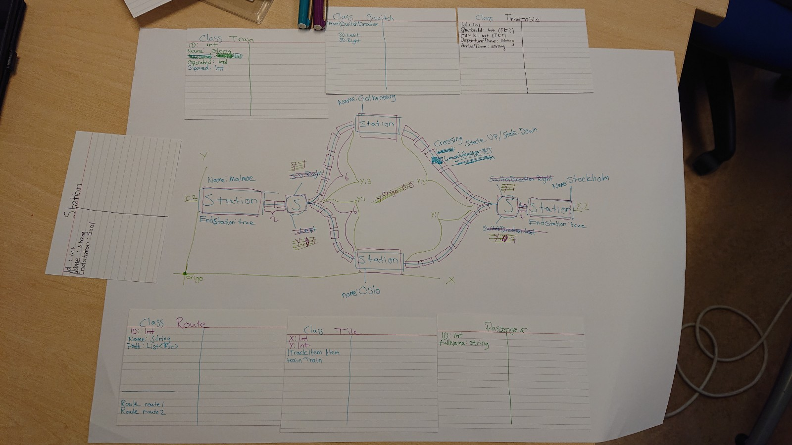
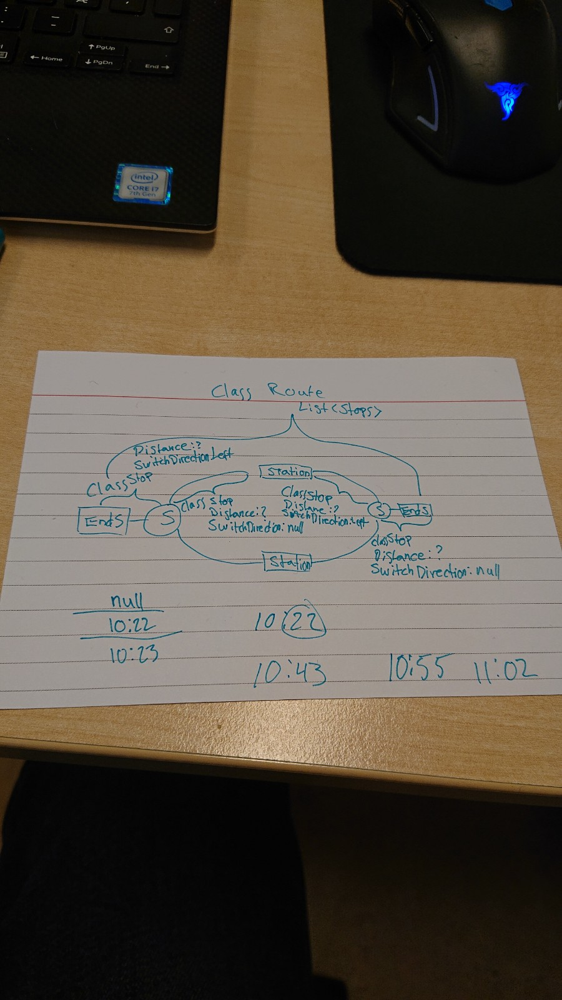
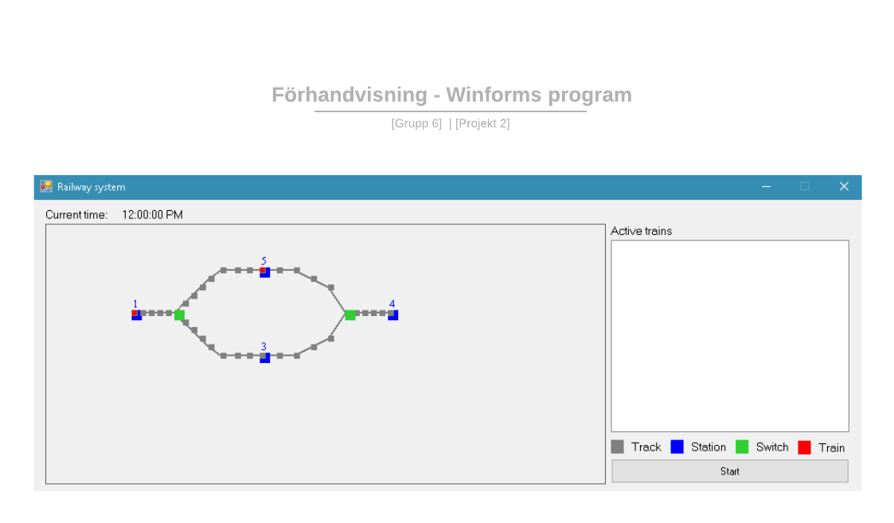

# Dokumentation

## Planering

Vi utgick länge ifrån mind mapen och klass-korten vi gjorde i början och gjorde justeringar längs med vägen. Vi tog turer vid datorn samt att spionera och diskuterade oss fram till olika lösningar.

Vid starten tänkte vi kolla så att Tågen inte kan kollidera med hjälp av positioner, men tiden räckte inte till för att implementera det. Idén var att varje objekt i tågsystemet skulle ha en koordinat (x, y), dessa objekt skulle vara spårdelarna, stationerna, växlarna och tågen. Detta är användbart eftersom vi kan veta när ett tåg når sin destination, när tåget når en växel, vilken vinkel växeln ha genom att ta hänsyn till tågets nuvarande position och nästa position. Vi kunde även använt tågets koordinat, destinationens koordinat samt tågets maxhastighet för att räkna ut hur långt tid det tar för tåget att t. ex. nå en station. Nedan följer en diagram som beskriver hur klasserna kunde ha sett ut. Som diagrammet visar var tanken att objekten skulle ärva från superklassen "Tile" och på så sätt få sina koordinater.

#### Klassdiagrammet

#### Förhandsvisning

## Design

* Vi beslutade att skapa objekten utifrån Data-filerna
* Vi valde att använda en "WorldTimer" för aktuell tid i Programmet, denna "WorldTimer" används som angivelse för vart Tågen befinner sig, med hjälp utav TidTabellerna
* Vi beslutade även att ha en tråd var för sig i varje Train objekt som parallelkörs
